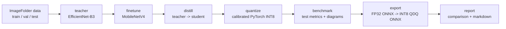

# Pipeline Notes

This is the current Ray-Ban classification pipeline. Keep this file aligned with `src/main.py`, `src/pipeline.py`, and `configs/config.yaml`.

## Current Flow



Stages:

- `teacher`: trains `teacher_for_distill.pth`.
- `finetune`: trains `mobilenetv4_finetuned.pth`.
- `distill`: trains `mobilenetv4_distilled.pth`.
- `quantize`: creates `mobilenetv4_quantized.pth` and PyTorch INT8 SNR metrics.
- `benchmark`: evaluates the quantized PyTorch checkpoint and saves confusion/confidence diagrams.
- `export`: creates FP32 ONNX, calibrated INT8 QDQ ONNX, and validates ONNX metrics.
- `report`: writes comparison JSON, benchmark diagram, and `classification_report.md`.

## Deployment Artifact

Use this file for Ray-Ban NPU deployment:

```text
exported_models/mobilenetv4_int8.onnx
```

It is a calibrated QDQ INT8 ONNX model. `exported_models/mobilenetv4.onnx` is only the FP32 intermediate used to build the INT8 export.

## Outputs

```text
checkpoints/
  teacher_for_distill.pth
  mobilenetv4_finetuned.pth
  mobilenetv4_distilled.pth
  mobilenetv4_quantized.pth
  benchmark_comparison.json
  benchmark_comparison.png
  classification_report.md
  mobilenetv4_quantized_confusion_matrix.png
  mobilenetv4_quantized_confidence_analysis.png
  teacher_training_curves.png
  student_training_curves.png

exported_models/
  mobilenetv4.onnx
  mobilenetv4.onnx.data
  mobilenetv4_int8.onnx
  mobilenetv4.pt2
  onnx_validation.json
```

## Validation Gates

Quantization validation:

- PyTorch INT8 SNR is computed during `quantize`.
- ONNX INT8 validation is computed during `export` and `report`.
- `quantize.max_onnx_accuracy_drop` defaults to `0.05`.
- Export fails if ONNX INT8 accuracy drops more than that threshold.
- SNR is reported as PASS/WARN. It only fails export if `quantize.snr.fail_below_min: true`.

Current observed ONNX result:

```text
FP32 ONNX accuracy: 0.8920
INT8 ONNX accuracy: 0.8709
Accuracy drop:      0.0211
INT8 ONNX size:     2.80 MB
INT8 GOPs:          0.185
Effective TOPS:     ~0.30 on local ONNX Runtime CPU
SNR logit:          9.48 dB (WARN)
```

The effective TOPS value is local ONNX Runtime throughput. Real Ray-Ban NPU TOPS must be measured after QNN/NPU compilation on target hardware.

## What We Tried

- Torchao static INT8 PyTorch checkpoint:
  - Worked for accuracy/SNR checking.
  - Did not reduce `.pth` size much because torchao quantized only the final `nn.Linear`; MobileNetV4 is mostly convolution.
  - Not the deployable artifact for Ray-Ban NPU.

- ONNX QDQ with signed activations and signed weights (`QInt8/QInt8`):
  - Produced a small INT8 ONNX.
  - Failed accuracy badly, around `0.244`.
  - SNR was near `0 dB`.

- ONNX QDQ with entropy and percentile calibration:
  - Still failed accuracy and SNR.
  - Did not fix the quantization error.

- ONNX QDQ with unsigned activations, signed per-channel weights (`QUInt8/QInt8`, `per_channel=True`):
  - Fixed accuracy to `0.8709`.
  - Kept the model small at about `2.80 MB`.
  - SNR is still WARN, but accuracy drop is within the configured deployment gate.

- FLOPs on torchao INT8 model:
  - `fvcore` cannot trace torchao static INT8 tensors and hits a PyTorch tracing assertion.
  - The pipeline now skips FLOPs for unsupported quantized PyTorch models instead of failing.
  - ONNX INT8 reports estimated INT8 GOPs and effective TOPS instead.

## Resume Behavior

Training stages write `*.last.pth` resume files. If a run crashes, use:

```bash
python3 classification/src/main.py resume --origin-run-id <run-id>
```

To force a clean stage restart, delete that stage's `.last.pth` file. The best checkpoint `.pth` remains available for downstream stages.

## Cloud Storage

`data.dir`, `paths.checkpoint_dir`, and `paths.export_dir` can be local, S3, or R2 paths. Remote data is staged into `paths.local_cache_dir`; outputs are synced back after stages.
