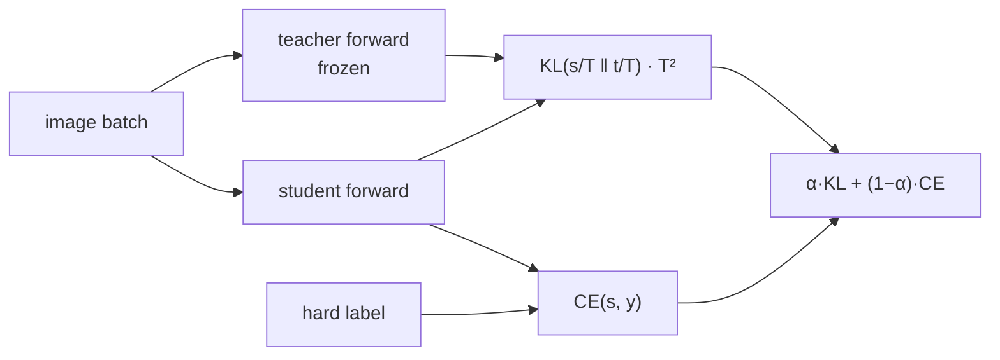

# Training Pipeline — Design Notes

End-to-end flow:

```mermaid
flowchart LR
    data["preprocessed data<br/>data/processed/classification_data"]
    teacher["train_teacher<br/>EfficientNet-B3"]
    ft["finetune<br/>MobileNetV4"]
    distill["distill<br/>KL + CE"]
    quant["quantize<br/>INT8 weight-only"]
    bench["benchmark<br/>acc / latency / GFLOPs / size"]
    exp["export<br/>TorchScript + torch.export"]

    data --> teacher
    teacher -->|teacher_for_distill.pth| ft
    teacher -.->|frozen, no_grad| distill
    ft -->|mobilenetv4_finetuned.pth| distill
    distill -->|mobilenetv4_distilled.pth| quant
    quant -->|mobilenetv4_quantized.pth| bench
    bench --> exp
    exp --> artifacts[("exported_models/<br/>mobilenetv4.pt<br/>mobilenetv4.pt2")] 
```

Six Metaflow `@step`s. Each earlier step's checkpoint feeds the next, checkpoints are logged to MLflow as artifacts, and metrics are logged per-epoch.

## 1. `train_teacher` — Fine-tune EfficientNet-B3

**Purpose.** Train a high-capacity model used only as a teacher.

**Behavior.**

- Two-phase: **probe** (head only, ~3 epochs) then **full** fine-tune (`AdamW`, cosine warmup).
- ImageNet pretrained weights → swap classifier head → `CrossEntropyLoss(label_smoothing)`.
- Best val checkpoint saved as `teacher_for_distill.pth`.

**Why this setup.**

- **EfficientNet-B3 over ResNet/ViT:** best accuracy-per-FLOP in the ImageNet family at this size (~12 M params). ResNet-50 is heavier for similar accuracy; ViT-B/16 needs much more data to transfer.
- **Two-phase probe:** freezes backbone for a few epochs so the new classifier head doesn't get drowned by random gradients; standard warm-up trick for transfer learning.
- **Cosine + warmup:** smooth LR decay beats step decay for fine-grained tuning; `LinearLR` → `CosineAnnealingLR` via `SequentialLR`.

## 2. `finetune` — Train MobileNetV4 Student (standalone)

**Purpose.** Produce a small, accuracy-reasonable student before distillation.

**Behavior.**

- `mobilenetv4_conv_small.e2400_r224_in1k` from **timm** (≈3 M params).
- Same two-phase schedule as the teacher.
- Train augmentations: `RandomResizedCrop(0.7–1.0)`, `HorizontalFlip`, `RandomRotation(±15°)`, `RandAugment(num_ops=2, magnitude=9)`, ImageNet-style `Normalize`.
- `MixUp` + `CutMix` applied via the dataloader collate (`v2.CutMix → v2.MixUp` chain) on the full-finetune path.

**Why these choices.**

- **MobileNetV4-Conv-Small:** chosen as the edge target — small enough to quantize & export well, recent Google research shows it closes the gap to larger ConvNets.
- **`timm` over hand-rolled:** weights are correctly named/registered, no surgery to swap the head.
- **`RandAugment` over hand-picked aug list:** breadth beats hand-tuning on small datasets; magnitude 9 keeps it tame.
- **MixUp + CutMix stack:** CutMix forces spatial localization, MixUp smooths decision boundaries; chaining both via collate is lightweight compared to a custom `Dataset`.

## 3. `distill` — Knowledge Distillation (KL + CE)

**Purpose.** Compress teacher signal into the student.

Loss composition:

**Behavior.**

- Freezes the teacher; student loaded from the finetune checkpoint.
- Loss: `α · KL(s/T ‖ t/T) · T² + (1−α) · CE(s, y)`, with `T=6.0`, `α=0.5` (config defaults).
- Same AdamW + cosine schedule.

**Why this setup.**

- **KL-on-softened-logits (Hinton):** the dominant distillation objective in literature; `T` widens the softmax so the teacher reveals dark knowledge (relative class similarities). `T=6` is a common mid-range default.
- **α = 0.5:** balanced blend between hard-label CE and soft-label KL. Lower α biases toward ground-truth, higher α toward teacher — 0.5 is a safe default, easy to tune per dataset.
- **CE on hard labels retained:** prevents the student from drifting away from true classes when teacher is imperfect.
- **Why not feature-map distillation (FitNets / attention transfer):** feature matching adds hooks and projector heads; for a 3 M-param student + 12 M-param teacher, logit distillation already captures the bulk of the accuracy transfer at a fraction of the engineering cost.

## 4. `quantize` — INT8 Weight-Only

**Purpose.** Make the student lightweight for deployment.

**Behavior.**

- Loads the distilled checkpoint on CPU.
- Preferred path: `torchao.quantize_(model, int8_weight_only())` then saves `mobilenetv4_quantized.pth`.
- Fallback path: `torch.quantization.quantize_dynamic({nn.Linear}, dtype=qint8)` if `torchao` isn't installed.

**Why this setup.**

- **Weight-only INT8 over static PTQ:** no calibration dataset needed, no need to recompile for a specific backend, and activations stay FP32 so accuracy degradation is minimal.
- **`torchao` over `torch.quantization`:** torchao preserves the module structure (still call-able as a normal `nn.Module`); the legacy dynamic-quantize path rewrites modules to `QuantizedLinear`, which complicates downstream `torch.export`.
- **Why not FP16 / INT4:** FP16 halves size but doubles memory bandwidth on CPU edge devices; INT4 needs per-channel calibration and offers diminishing returns on a 3 M-param model.

## 5. `benchmark` — Accuracy, Latency, Size, FLOPs

**Purpose.** Produce the metrics that justify the pipeline.

**Behavior.** Runs `evaluate()` on the test split, `benchmark_latency()` (100 runs + 10 warmup, ms), `model_size_mb()`, and `count_flops()` via `fvcore` if available.

**Why this matters.** The whole point of **teacher → student → distill → quantize** is the trade-off table this step prints:

- `test_acc` (quality)
- `latency_ms` (speed, on the actual `device`)
- `model_size_mb` (deploy footprint)
- `gflops` (compute envelope)

## 6. `export` — TorchScript & `torch.export`

**Purpose.** Produce portable artifacts independent of the training repo.

**Behavior.**

- `torch.jit.trace` → `mobilenetv4.pt`
- `torch.export.export` → `mobilenetv4.pt2`
- Both saved under `exported_models/` and logged to MLflow.

**Why two formats.**

- **TorchScript:** mature, runs on `libtorch` C++ and on PyTorch Mobile — broadest compatibility for older edge stacks.
- **`torch.export`:** the modern ATen-graph format; future-proof for ExecuTorch / XNNPACK / Inductor. We don't ship a third `.pte` artifact here so the pipeline stays framework-light, but re-using `mobilenetv4.pt2` with `executorch` is a one-liner off-pipeline.

## Common Choices Across Stages

- **MLflow local SQLite** (`sqlite:///mlflow.db`): zero-ops tracking; switch to a remote URI via `paths.mlflow_tracking_uri`.
- **Hydra configs** instead of argparse: layered overrides (`finetune.lr=…`, `@package _group_` per stage file) compose cleanly without copy-pasting defaults.
- **Metaflow `@retry(times=2)` + `@resources(cpu/memory/gpu)`**: training steps retry on transient faults and declare compute needs explicitly — same code runs locally, on Kubernetes, or on AWS Batch.
- **Determinism:** `torch.manual_seed(42)` at the top of each stage; v2 transforms are deterministic up to DataLoader worker shuffle.
