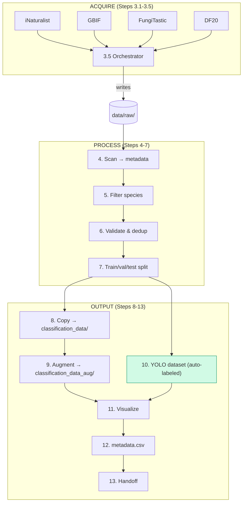

# `data_preprocessing.ipynb` — Engineering Audit

> Cell ids are the ground truth. Where the report and code disagree, the code wins.

---

## 1. Summary

13-step pipeline: ~500 mushroom images from 4 public APIs → two model-ready datasets (224×224 classification + YOLO detection). **All 🔴 blockers resolved.** Ready for training runs.

| Severity | Count | Key remaining issues |
|---|---:|---|
| 🔴 **Blocker** | 0 ✅ | All resolved |
| 🟠 **High** | 9 | Silent `except: pass` in Step 3 fetchers; `np.random.seed()` global side effect; detection dataset not augmented; no copy integrity check |
| 🟡 **Medium** | 9 | No k-fold CV; no schema validation; `_aug` filter fragile; per-cell `%pip install`; hard-coded config; no pipeline stats |
| 🟢 **Low** | 5 | Unicode normalization; stale visualization; inconsistent cell ids |

**Resolved (since initial audit):** P0 items 1-5 (placeholder YOLO bboxes → auto-labeled, handoff path, `pipeline_version` + atomic write, `traceback.print_exc()`, `.head()` → `.sample()`). P1 items 11 (perceptual-hash dedup).

---

## 2. Pipeline Architecture

**Outputs consumed by:** `train_classification.ipynb` (reads `classification_data_aug/`), `train_detection.ipynb` (reads `detection_data/`).

---

## 3. Per-Step Findings

### Step 1 — Setup (`md-1` / `code-2`) — 🟢 Low
- 🟢 No Unicode normalization in `safe()` — add `unicodedata.normalize('NFKC', name)` if non-Latin species names are added.

### Step 2 — Paths and config (`md-3` / `code-4`) — 🟡 Medium
- 🟡 Hard-coded `TARGET_SPECIES` and `SUBSET_PER_SPECIES` — extract to `config.yaml`. (P2 #18)
- 🟢 No validation of species names — typos silently filter everything.

### Step 3 — Download from APIs (`step3-main-md` + 5 sub-cells) — 🟠 High
- 🟠 Silent `except: pass` in every fetcher — add per-source failure logging. (P1 #6)
- 🟠 No retry logic — add `tenacity` with exponential backoff. (P1 #7)
- ✅ `API_DELAY` serial bottleneck resolved — `ThreadPoolExecutor(max_workers=4)` across species×source combos.
- 🟡 DF20 is manual; per-source code duplication — refactor to `SourceFetcher` base class. (P2 #20)

### Step 4 — Build metadata (`md-5` / `code-6`) — 🟡 Medium
- 🟡 No schema validation — add `pandera` or `assert` statements. (P1 #10)
- 🟡 `normalize_species` fragile for subspecies/varieties.

### Step 5 — Filter & subset (`md-7` / `code-8`) — ✅ Resolved
- ✅ `.head()` → `.sample(n=min(len(g), SUBSET_PER_SPECIES), random_state=RANDOM_SEED)`.

### Step 6 — Validate & dedup (`md-9` / `code-10`) — 🟡 Medium (1 resolved)
- ✅ Perceptual-hash dedup added (`imagehash.phash`, Hamming ≤ 5).
- 🟡 No content validation — add CLIP zero-shot check for mislabeled images. (P2)

### Step 7 — Train/val/test split (`md-11` / `code-12`) — 🟡 Medium
- 🟡 Single split, no k-fold — val/test ~5-7 images per class, unstable accuracy. (P2 #16)
- 🟡 Test set not strictly held out — document "test touched once" rule. (P1 #12)

### Step 8 — Copy classification images (`md-13` / `code-14`) — 🟡 Medium
- 🟡 No integrity check after copy — compare SHA-256 source vs dest. (P1 #9)

### Step 9 — Albumentations augmentation (`step9-md` / `step9-code`) — 🟠 High (1 resolved)
- ✅ `traceback.print_exc()` added in except block.
- 🟠 `np.random.seed()` global side effect — use `A.ReplayCompose` for determinism. (P2 #13)
- 🟡 `"_aug" in p.stem` fragile filter — use `name.startswith(stem + "_aug")`. (P1 #8)
- 🟡 Idempotency check skips corrupt files — add `Image.verify()`.
- 🟡 `%pip install albumentations` per-cell — move to setup cell. (P2 #14)
- 🟢 `A.Resize(224,224)` distorts aspect ratio — use `SmallestMaxSize + CenterCrop`. (P2 #15)

### Step 10 — YOLO detection dataset (`step9-det-md` / `step9-det-code`) — ✅ Resolved
- ✅ Placeholder bboxes → Grounding DINO auto-labeling + multi-class (8 species).
- 🟠 Detection dataset not augmented — add `bbox_params` to Albumentations pipeline.

### Step 11 — Visualization (`step-8-md` / `step-8-code`) — 🟡 Medium
- 🟡 Shows old PIL pipeline, not current Albumentations — regenerate from versioned script. (P2 #17)
- 🟡 Embedded base64, not diffable — write to `docs/figures/`.

### Step 12 — Save metadata (`md-15` / `code-16`) — ✅ Resolved (2 of 3)
- ✅ `pipeline_version` column + atomic-promote pattern added.
- 🟡 CSV type preservation fragile on Windows — consider Parquet. (P2)

### Step 13 — Handoff (`md-17`) — ✅ Resolved
- ✅ Path corrected to `classification_data_aug/`, blocker warning added.

---

## 4. Cross-Cutting Issues

- **Two competing output trees** (`classification_data/` vs `classification_data_aug/`) — add `manifest.json` in `data/processed/`.
- **Partial determinism** — Steps 1-8 deterministic; Step 9+ global-state-dependent via `np.random.seed()`.
- **No pipeline metrics** — add `_pipeline_stats.json` with per-step counts and durations. (P2 #19)
- **Idempotency via string matching** — Steps 8/9/10 skip existing files without verifying validity.
- **`metadata.csv` is documentation, not a contract** — either commit to it as a data contract or replace with `manifest.json`.

---

## 5. Roadmap

### P0 — Before next training run ✅ All done

| # | Item | Cell | Effort | Status |
|---|---:|---|---|---|
| 1 | Replace placeholder YOLO bboxes | `step9-det-code` | L | ✅ Auto-labeled (Grounding DINO) |
| 2 | Fix Step 13 handoff path | `md-17` | S | ✅ |
| 3 | Add `pipeline_version` + atomic write | `code-16` | S | ✅ |
| 4 | Add `traceback.print_exc()` | `step9-code` | S | ✅ |
| 5 | `.head()` → `.sample()` | `code-8` | S | ✅ |

### P1 — Next iteration

| # | Item | Cell | Effort |
|---|---:|---|---|
| 6 | Per-source failure logging | `step3-1..5-code` | M |
| 7 | `tenacity` retry in Step 3 | `step3-1..5-code` | M |
| 8 | Fix `_aug` substring filter | `step9-code` | S |
| 9 | SHA-256 integrity check after copy | `code-14` | S |
| 10 | Schema validation (pandera/asserts) | `code-6` | S |
| 11 | Perceptual-hash dedup | `code-10` | M ✅ |
| 12 | Document test holdout rule | `md-11` | S |

### P2 — Backlog

| # | Item | Cell | Effort |
|---|---:|---|---|
| 13 | `A.ReplayCompose` determinism | `step9-code` | M |
| 14 | Move `%pip install` to setup cell | `step9-code` | S |
| 15 | Aspect-ratio-preserving resize | `step9-code` | S |
| 16 | K-fold cross-validation | `code-12` | M |
| 17 | Versioned visualization script | `step-8-code` | M |
| 18 | Extract config to `config.yaml` | `code-4` | S |
| 19 | Pipeline stats JSON | multiple | M |
| 20 | `SourceFetcher` base class | `step3-1..5-code` | M |
| 21 | Parallelize Step 3 downloads | `step3-5-code` | M ✅ |
