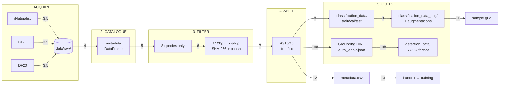

# `data_preprocessing.ipynb` — Pipeline Report

13-step reproducible pipeline that turns ~500 mushroom images from 4 public biodiversity APIs into two model-ready datasets.

---

## Pipeline Architecture

**Outputs consumed by:**

- `train_classification.ipynb` → `data/processed/classification_data_aug/`
- `train_detection.ipynb` → `data/processed/detection_data/`

---

## Per-Step Breakdown

### Step 1 — Setup (`code-2`)

**What:** Imports all shared libraries (`Path`, `shutil`, `hashlib`, `random`, `pandas`, `numpy`, `PIL`, `tqdm`, `sklearn`, `matplotlib`, `json`), sets `RANDOM_SEED=42`, defines `safe()` for filesystem-friendly species names.

**Why:** Single import cell ensures all downstream cells share the same namespace and random state.

**Notes:**

- `safe()` only replaces spaces, `/`, `:` — add `unicodedata.normalize('NFKC')` if non-Latin species names are added.

---

### Step 2 — Paths & Config (`code-4`)

**What:** Defines `RAW_DIR`, `PROCESSED_DIR`, `CLASSIFICATION_DIR`, `DETECTION_DIR`, `TARGET_SPECIES` (8 species).

**Why:** Central config makes it easy to change species or limits without hunting through cells.

**Notes:**

- Config is hard-coded — extract to `config.yaml` for production.
- No species-name validation — typos silently filter everything.

---

### Step 3 — Download from APIs (`step3-1` through `step3-5`)

**What:** Four independent API fetchers (`iNaturalist`, `GBIF`, `FungiTastic`, `DF20`) pulled together by a `ThreadPoolExecutor(max_workers=4)` orchestrator in `step3-5-code`. Downloads up to 30 images per (species, source) into `data/raw/<source>/<Species>/`.

**Why:** Parallel download cuts API delay bottleneck (~5× speedup vs serial). Each fetcher is independent so individual sources can break without blocking others.

**Notes:**

- `FungiTastic` has no public subset API — returns `[]`, images must be placed manually.
- `DF20` writes a wishlist file; images must be extracted from the tarball manually.
- Silent `except: pass` in fetchers — add per-source failure logging + retry logic (`tenacity`).
- `API_DELAY=0.2s` preserved per-thread for politeness.

---

### Step 4 — Build Metadata (`code-6`)

**What:** Walks `data/raw/` and builds a pandas DataFrame with `image_path`, `dataset`, `raw_species`, `canonical_species` for every image file found.

**Why:** Single source of truth for all downstream operations. `normalize_species()` handles common formatting variations.

**Notes:**

- `canonical_species` column is the join key for all downstream filtering.
- No schema validation — add `pandera` checks or `assert` statements for production.

---

### Step 5 — Filter (`code-8`)

**What:** Filters the metadata to the 8 `TARGET_SPECIES`. Every image that survives this step is retained; there is no per-(species, source) sub-cap.

**Why:** Restricts the working dataset to just the species of interest so every downstream step (split, augmentation, training, detection) operates on the same reduced universe.

---

### Step 6 — Validate & Deduplicate (`code-10`)

**What:** Three-pass cleaning:

1. Drops images smaller than 128px in either dimension
2. SHA-256 byte-level dedup (exact duplicates)
3. Perceptual-hash dedup (`imagehash.phash`, Hamming ≤ 5) for near-duplicates (re-saves at different quality, slight crops, re-compression)

**Why:** SHA-256 catches byte-identical files; phash catches visually identical images that differ at the byte level. Greedy dedup keeps the first image in each near-duplicate cluster.

**Notes:**

- No content validation — consider CLIP zero-shot check for mislabeled images.
- Greedy O(N²) dedup is fine for ~500 images; switch to BKTree for larger datasets.

---

### Step 7 — Train / Val / Test Split (`code-12`)

**What:** Stratified 70/15/15 split via `sklearn.train_test_split` with `random_state=RANDOM_SEED`.

**Why:** Stratification ensures each species appears proportionally in each split — critical when some species have fewer images.

**Notes:**

- Single split, no k-fold — val/test ~5-7 images per class, accuracy estimates will be noisy.
- Test set is not strictly held out — if re-running the notebook, the split is reproducible but reused.
- Consider k-fold CV for publication-quality results.

---

### Step 8 — Build Classification Dataset (`code-14`)

**What:** Copies every image into `data/processed/classification_data/{train,val,test}/{Species}/`. Idempotent — skips existing files.

**Why:** Creates a clean, split-organized directory tree ready for training. Preserves original filenames for traceability.

**Notes:**

- No integrity check after copy — add SHA-256 comparison for production.
- File copy, not symlink — doubles disk usage but avoids accidental mutation of raw data.

---

### Step 9 — Augmentation (`step9-code`)

**What:** Applies Albumentations pipeline:

- **Train:** RandomResizedCrop (224×224), HorizontalFlip, Rotate (±15°), ColorJitter (brightness/contrast/saturation only, no hue), GaussianBlur (p=0.2). Generates 3 augmented copies per original.
- **Val/Test:** Deterministic Resize to 224×224 only.

Outputs to `data/processed/classification_data_aug/` (parallel directory — raw copies in `classification_data/` are never modified).

**Why:** Augmentation prevents overfitting on a small dataset. Hue jitter is excluded because mushroom color is diagnostic. Separate `_aug/` directory preserves raw splits for debugging.

**Notes:**

- `_aug` substring filter for idempotency is fragile — replace with `name.startswith(stem + "_aug")`.
- `np.random.seed()` global side effect — use `A.ReplayCompose` for deterministic replay.
- `A.Resize(224,224)` distorts aspect ratio — use `SmallestMaxSize + CenterCrop` for production.
- `%pip install albumentations` per-cell — move to setup cell.
- Augmentation failures print full traceback for debugging.

---

### Step 10a — Auto-Labeling (`step10-auto-code`)

**What:** Runs [Grounding DINO](https://huggingface.co/IDEA-Research/grounding-dino-tiny) on every image to generate real bounding boxes. Caches results to `data/processed/auto_labels.json`.

**Why:** Replaces the previous full-frame placeholder bboxes with real object detection. Multi-class support (8 species) enables per-species detection.

**Notes:**

- ~700 MB model download on first run, cached afterward.
- Falls back to center 80% crop if model unavailable.
- `BOX_THRESHOLD=0.25`, `TEXT_THRESHOLD=0.25` — tune for different precision/recall tradeoffs.

---

### Step 10b — Build Detection Dataset (`step9-det-code`)

**What:** Reads `auto_labels.json`, writes YOLO-format dataset to `data/processed/detection_data/`:

- `images/{train,val,test}/<image>.jpg`
- `labels/{train,val,test}/<image>.txt` (one line per bbox: `class_id xc yc w h`)
- `yolo.yaml` with `nc=8`, per-species class names

**Why:** Standard YOLO directory layout for direct consumption by Ultralytics YOLO training.

**Notes:**

- Detection dataset is not augmented — add `bbox_params` to the Albumentations pipeline for detection training.
- Real vs fallback bbox counts reported in output.

---

### Step 10c — Correction Workflow (`step10-correction-code`)

**What:** Quality assessment of auto-labels — reports good / needs-review / fallback counts and writes `review_list.tsv` for external labeling tools.

**Why:** Grounding DINO bboxes are good but not perfect. Manual review of low-confidence detections improves detection quality.

**Notes:**

- `LOW_CONF_THRESHOLD=0.3` — adjust based on desired precision/recall balance.
- Open flagged images in LabelImg, Roboflow, or CVAT to correct.

---

### Step 11 — Visualization (`step-8-code`)

**What:** Displays a 3-column grid (original | preprocessed (raw) | augmented) for up to 6 species. Shows the same image at different pipeline stages.

**Note:** The "preprocessed" column is a verbatim copy on disk — no resize. The dataloader resizes each batch to 224×224 at train time via `Resize(256) → CenterCrop(224)` for eval and `RandomResizedCrop(224)` for train. Pre-resizing on disk would force the model to upscale a 224px image back to 256px at eval, degrading quality.

**Why:** Sanity check — verifies preprocessing and augmentation look reasonable before training.

**Notes:**

- Embedded in notebook, not diffable — write to `docs/figures/` for version control.
- Shows only 6 species max — adjust `species_list[:6]` to see more.

---

### Step 12 — Save Metadata (`code-16`)

**What:** Saves `metadata.csv` with `pipeline_version` column and timestamped atomic write (`out_tmp → out`).

**Why:** `pipeline_version` enables tracking which pipeline produced which dataset. Atomic write prevents partial files if the cell is interrupted.

**Notes:**

- CSV type preservation fragile on Windows — consider Parquet for production.
- Timestamp in filename allows version history if needed.

---

### Step 13 — Handoff (`md-17`)

**What:** Points downstream notebooks at the appropriate datasets and documents the config style each consumer uses.

**Notes:**

- **`train_classification.ipynb`** — local / Apple Silicon consumer. Uses a **bare module-level config block** (not a `@dataclass`), matching the user's preferred notebook style:
  - `data_dir = Path('data/processed/classification_data')` — points at the **raw** split-organized tree, *not* `classification_data_aug/`.
  - The `ensure_classification_data()` cell materializes the dataset on disk in two possible forms: real **copies** when Step 8 has already populated `classification_data/`, or a metadata-driven **symlink overlay** from `data/raw/<source>/<Species>/<file>` → `data/processed/classification_data/<split>/<raw_species>/<file>` when run on a fresh project. In the symlink-overlay case, the dataset is a thin overlay (no duplicate copies); in the real-copies case, the helper detects those pre-existing files and creates zero symlinks. Both forms are read transparently.
  - All hyperparameters (`num_classes`, `image_size`, `ft_arch`, `teacher_arch`, `ft_*`, `distill_*`, `seed`, `patience`, `workers`) are bare-name module-level constants in the config cell.
  - Device selection auto-falls back through `cuda` → `mps` → `cpu` (Apple Silicon supported).
- **`train_classification.py`** — cloud-GPU consumer. Uses `@dataclass Config` and points at `data/processed/classification_data_aug/` (the augmented copies); run this script on a CUDA host.
- **`train_detection.ipynb`** — unchanged; points at `data/processed/detection_data/`.

---

## Output Specification

| Output | Path | Format | Consumer |
| --- | --- | --- | --- |
| Raw images | `data/raw/<source>/<Species>/` | JPEG/PNG | — |
| Metadata | `data/processed/metadata.csv` | CSV | Debugging |
| Classification (raw) | `data/processed/classification_data/` | JPEG/PNG (copies or symlinks) | `train_classification.ipynb` |
| Classification (aug) | `data/processed/classification_data_aug/` | JPEG | `train_classification.py` |
| Auto-labels | `data/processed/auto_labels.json` | JSON | Step 10b |
| Detection dataset | `data/processed/detection_data/` | YOLO | `train_detection.ipynb` |
| Review list | `data/processed/review_list.tsv` | TSV | LabelImg/Roboflow |

---

## Key Design Decisions

1. **Two output trees** — `classification_data/` and `classification_data_aug/` (augmented) coexist so the **raw splits are never mutated** by the augmentation pipeline. `classification_data/` is a split-organized tree whose on-disk form depends on run order: real **copies** when Step 8 ran first (the notebook's `ensure_classification_data()` then detects pre-existing files via its `dst.exists()` / `dst.is_symlink()` gate and creates zero symlinks in that case), or a metadata-driven **symlink overlay** onto `data/raw/` when the notebook ran first on a fresh project. Both formats are read transparently by the downstream training consumer. In the symlink-overlay case, editing a path under `classification_data/` writes through to `data/raw/<source>/<Species>/<file>` (treat the raw tree as read-only when running the notebook first).
2. **Idempotency via existence checks** — all copy/augment/write steps skip existing files so re-running the notebook is safe.
3. **Deterministic with `RANDOM_SEED`** — Steps 1-7 are fully deterministic. Step 9+ uses `np.random.seed()` internally (not fully deterministic across runs but reproducible within a run).
4. **Multi-source design** — each API fetcher is independent; adding a new source requires one new fetcher cell + one line in `SOURCES`.
5. **Per-consumer on-disk form** — `train_classification.ipynb` consumes `classification_data/`, which is real **copies** when Step 8 ran first, or a metadata-driven **symlink overlay** onto `data/raw/` when the notebook ran first on a fresh project; both formats read transparently. The helper cell is idempotent and heals broken links on re-run. `train_classification.py` consumes `classification_data_aug/` directly (the augmented copies already on disk from Step 9).
