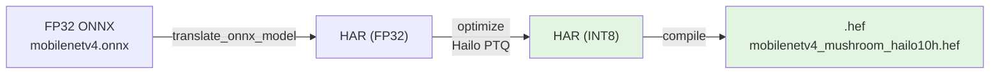
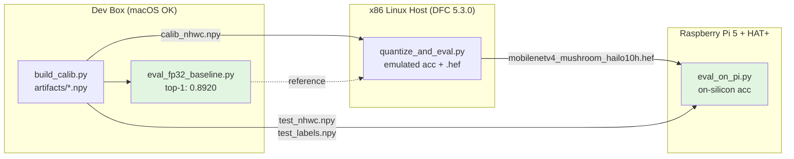

# Hailo-10H (Raspberry Pi 5 + HAT+) Deployment & Retest

How the mushroom classifier goes from the FP32 ONNX to a `.hef` running on the
**Hailo-10H** NPU, and how to retest accuracy at every step.

Scripts live in [`classification/hailo/`](../classification/hailo/).

---

## 1. Which ONNX do we export — FP32 or INT8 QDQ?

**FP32.** Feed `exported_models/mobilenetv4.onnx` (the FP32 graph) to the Hailo
compiler — **not** `mobilenetv4_int8.onnx` (the INT8 QDQ graph).

The Hailo Dataflow Compiler (DFC) pipeline is:



- The Hailo-10H is an **integer accelerator** — it does not execute FP32 at
  runtime. But the *compiler input* must be FP32, because the `optimize` step
  runs Hailo's own INT8 quantization with scales/zero-points tuned to the
  Hailo silicon, and it needs **float weights** to compute them.
- `mobilenetv4_int8.onnx` is already quantized (weights rounded to int8, with
  `QuantizeLinear`/`DequantizeLinear` nodes baked in by onnxruntime). Feeding it
  to Hailo causes **double quantization** — quality loss — and the parser often
  rejects the QDQ nodes outright.
- That INT8 QDQ ONNX exists for a **different** target: the Ray-Ban Snapdragon
  AR1 (Hexagon NPU), which runs the QDQ graph directly. It is **not** the Hailo
  artifact. See [PIPELINE.md](../classification/PIPELINE.md) "Deployment Artifacts".

**So:** FP32 in → Hailo produces the int8 itself.

> `mobilenetv4.onnx` stores weights externally in `mobilenetv4.onnx.data`.
> Copy **both** files to the compiler host.

---

## 2. "We feed FP32, so do we still rebuild calibration and retest?" — Yes, both

Feeding FP32 ≠ running FP32. FP32 is only the *compiler input*; on-device the
model runs in **8-bit**. The `optimize` step gets there by quantizing, and that
needs a **representative calibration set**.

**Rebuild calibration because:**

- The onnxruntime calibration reader used for the QDQ export
  ([pipeline.py](../classification/src/pipeline.py) `ImageCalibrationReader`) is
  onnxruntime-specific plumbing. Hailo wants a **NumPy `.npy`** array.
- Format: **NHWC float32** (Hailo's layout), shape `(N, 224, 224, 3)`.
- ⚠️ **Numeric space must match the ONNX input.** This is the #1 accuracy
  killer. The lab's `capture_calib_dataset.py` emits NHWC float32 in **[0,1]** —
  correct only for a model whose ONNX input is [0,1]. **`mobilenetv4.onnx` has
  no preprocessing in its graph**, so its input is **ImageNet-normalized**
  (~[-2.6, 2.6]). Our calibration is therefore normalized too, and **on-device
  inference must apply the same `Resize(256)→CenterCrop(224)→/255→normalize`**
  before feeding the HEF.

**Retest because:**

- Quantization is algorithm- and hardware-specific. The numbers in
  [`exported_models/onnx_validation.json`](../exported_models/onnx_validation.json)
  (INT8 QDQ: 87.1%, SNR 9.5–13.5 dB, `WARN: SNR below 20 dB`) are
  **onnxruntime's** quantization — they do **not** transfer to Hailo. Hailo
  produces its own quantized model with its own accuracy, which you must measure.
- Given the onnxruntime INT8 already showed a borderline SNR warning, this model
  is quantization-sensitive — retesting on Hailo is not a formality.

| Question | Answer | Why |
| --- | --- | --- |
| FP32 or INT8 ONNX into Hailo? | **FP32** | Hailo does its own int8 PTQ; a QDQ ONNX = double quantization |
| Rebuild calibration? | **Yes** | NPU runs int8; Hailo re-quantizes FP32 and needs calib in its format & input space |
| Retest accuracy? | **Yes** | Hailo's quantization ≠ onnxruntime's; existing accuracy/SNR don't carry over |

---

## 3. Hardware target — Hailo-**10H**, not Hailo-8

The Pi 5 + HAT+ in this project is a **Hailo-10H**. A `.hef` compiled for
`hailo8`/`hailo8l` **will not load** on the Hailo-10H runtime. `hw_arch` is set
to `hailo10h` in [config.yaml](../classification/configs/config.yaml). Compilation
uses **Hailo Dataflow Compiler 5.3.0** on an x86 Linux host (the lab's
`exportyolov26n` conda env). The DFC is **not** installable on macOS/the dev box.

---

## 4. Retest flow

Three machines, three accuracy numbers that should line up:



| Step | Where | Script | Output |
| --- | --- | --- | --- |
| Build calib + test arrays | dev box (macOS ok) | `build_calib.py` | `artifacts/*.npy` |
| FP32 baseline | dev box (onnxruntime) | `eval_fp32_baseline.py` | **0.8920** ✅ verified |
| Quantize + emulate + compile | x86 host (DFC 5.3.0) | `quantize_and_eval.py` | emulated acc + `.hef` |
| On-device | Raspberry Pi 5 | `eval_on_pi.py` | on-silicon acc |

All four feed the **same** ImageNet-normalized NHWC arrays, so any accuracy gap
is pure quantization error.

### 4.1 Build calibration + eval arrays (dev box)

```bash
.venv/bin/python classification/hailo/build_calib.py
```

Writes to `classification/hailo/artifacts/`:

- `calib_nhwc.npy` `(256, 224, 224, 3)` — Hailo `optimize` calibration (val split)
- `test_nhwc.npy` `(426, 224, 224, 3)` + `test_labels.npy` — accuracy eval
- `classes.json` — index → class name (ImageFolder order)

Reuses the exact eval transform from `classification.src.core`, so the calib
distribution matches what the network was validated on. Values are normalized
(range ≈ [-2.1, 2.6]) — **not** [0,1].

> Domain note: the lab guide stresses calibrating on *real deployment-camera*
> frames. The val split is a reasonable representative set for mushroom photos;
> if the Pi camera's color/lighting differs noticeably, capture ~128 real frames
> through the same preprocessing and use those for `calib_nhwc.npy` instead.

### 4.2 FP32 baseline (dev box)

```bash
.venv/bin/python classification/hailo/eval_fp32_baseline.py
# -> FP32 ONNX top-1 accuracy: 0.8920  (matches onnx_validation.json exactly)
```

This is the reference the quantized model is judged against.

### 4.3 Quantize, emulate, compile (x86 host, DFC 5.3.0)

Copy `mobilenetv4.onnx` **+ `mobilenetv4.onnx.data`** and the `artifacts/` npy
files to the host, then:

```bash
conda activate exportyolov26n
python3 classification/hailo/quantize_and_eval.py \
    --onnx exported_models/mobilenetv4.onnx \
    --calib classification/hailo/artifacts/calib_nhwc.npy \
    --test  classification/hailo/artifacts/test_nhwc.npy \
    --labels classification/hailo/artifacts/test_labels.npy \
    --hef   exported_models/mobilenetv4_mushroom_hailo10h.hef \
    --har   exported_models/mobilenetv4_mushroom_hailo10h.har
```

Runs translate → optimize(calib) → emulated quantized eval → compile. Prints the
**emulated quantized top-1** (compare to 0.8920; a drop > ~0.05 means revisit
calibration) and writes the HEF. Verify the HEF header:

```bash
hailortcli parse-hef exported_models/mobilenetv4_mushroom_hailo10h.hef | head
# architecture string should mention hailo10h
```

> The lab's `convert_hef_file.py --onnx mobilenetv4.onnx --hw-arch hailo10h
> --calib-npy calib_nhwc.npy` produces the same HEF, but `quantize_and_eval.py`
> also prints the emulated accuracy in one pass — the actual retest.

### 4.4 On-device retest (Raspberry Pi 5)

```bash
scp exported_models/mobilenetv4_mushroom_hailo10h.hef pi@<pi>:~/mushroom/
scp classification/hailo/artifacts/test_nhwc.npy      pi@<pi>:~/mushroom/
scp classification/hailo/artifacts/test_labels.npy    pi@<pi>:~/mushroom/

# On the Pi (HailoRT installed)
python3 eval_on_pi.py \
    --hef mushroom/mobilenetv4_mushroom_hailo10h.hef \
    --test mushroom/test_nhwc.npy \
    --labels mushroom/test_labels.npy
# -> Hailo-10H ON-DEVICE top-1: <acc>
```

`eval_on_pi.py` also contains `_preprocess_frame()` — the reference camera→tensor
preprocessing (same normalize) to use for live picamera2 inference, so runtime
input matches the calibration distribution.

---

## 5. If accuracy drops too much

The classic INT8 failure is one class collapsing (watch the per-class numbers in
`eval_fp32_baseline.py` — `Agaricus_bisporus` is already the weakest at 0.72).
Levers, cheapest first:

1. **More / more representative calibration** — raise `export.hailo.calibration.batches`,
   or calibrate on real Pi-camera frames.
2. **Hailo optimization level / model script** — higher `optimization_level`,
   or per-layer precision (keep the final classifier layer in 16-bit) via a DFC
   model script passed to `optimize()`.
3. **Re-export with normalization baked in** — if you'd rather feed [0,1] frames
   on-device (and reuse the lab's [0,1] capture/inference scripts unchanged),
   add a normalization layer to the model and rebuild calibration in [0,1]. More
   work now; simpler runtime preprocessing later.
